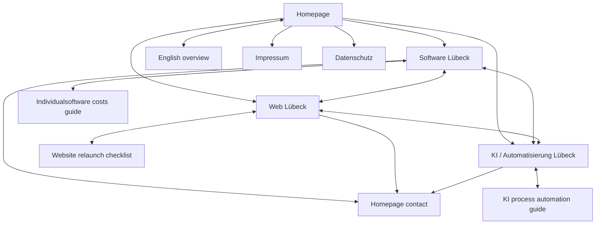

# Internal link architecture

Updated 2026-09-15. Ten canonical pages: seven core/legal pages plus three approved authority assets.
All paths resolve under `https://datenpflege-nord.de/`.

## Actual Phase 1–3 edges

| Source | Destination | Purpose / natural anchor |
|---|---|---|
| `/` | S, W, A | Service-detail links; one click from homepage |
| `/` | `/softwareentwicklung-luebeck/#schnittstellen` | Homepage systems/interfaces card assigns API and interface intent explicitly to S |
| S | `#entscheidung`, `#schnittstellen`, `#projektstart` | Local decision navigation: Standard oder individuell; APIs und Schnittstellen; Projekt vorbereiten |
| W | `#entscheidung`, `#projektstart` | Website-Entscheidung and project preparation |
| A | `#entscheidung`, `#projektstart` | Workflow choice and process inputs |
| W | `/softwareentwicklung-luebeck/#entscheidung` | Web application with business logic belongs to Software |
| W | `/softwareentwicklung-luebeck/#schnittstellen` | API/Schnittstellen planning for website integration |
| A | `/softwareentwicklung-luebeck/#schnittstellen` | API access and data connections, avoiding duplicate tutorial |
| S | `/ki-automatisierung-luebeck/#entscheidung` | Multistep workflow/approval choice beyond the interface |
| Each core owner | Other two core owners | Existing related-service cards |
| Each core owner | `/#kontakt` | Existing next-action CTA; linked input checklist improves inquiry context |
| S | `/wissen/individualsoftware-kosten/` | Natural bridge for cost factors, scope and Make-or-Buy questions |
| `/wissen/individualsoftware-kosten/` | S | Commercial implementation owner after decision support |
| W | `/wissen/website-relaunch-checkliste/` | Planning bridge for URL inventory, staging, launch and verification |
| `/wissen/website-relaunch-checkliste/` | W | Commercial relaunch owner after checklist work |
| A | `/wissen/ki-prozessautomatisierung/` | Architecture bridge for deterministic vs AI-assisted automation, approval and failure-path decisions |
| `/wissen/ki-prozessautomatisierung/` | A | Local commercial implementation owner after the national decision guide |
| `/wissen/ki-prozessautomatisierung/` | `/softwareentwicklung-luebeck/#schnittstellen` | API/system-connection detail without creating a competing standalone API owner |
| `/en/` | `/` | The English overview links back to the German homepage; it does **not** directly link to S, W or A. Service discovery from `/en/` is therefore `/en/` → `/` → S/W/A. |
| All pages | Legal pages / home | Provider identity, privacy and return path |

Fragments are not sitemap URLs or new canonical owners. Authority links are present in initial HTML, readable without JavaScript and resolve to unique routes. Authority assets link only where buyer tasks genuinely intersect. No footer link farm, links to HOLD candidates, repeated exact-keyword anchor blocks or city lists were added.

## Supporting and regional architecture after future gates

The three approved decision assets receive a contextual link from their commercial owner and link back with a task-specific anchor. A future API owner requires a deliberate update to S/W/A and this graph. A passing Kiel page would link to W where the broader service explanation helps and have its own truthful conversion reason; a redirecting city funnel or duplicated service page is unacceptable. Hamburg remains HOLD on area truth.

## Validation

`python3 scripts/site_audit.py` checks internal targets/fragments. `python3 scripts/golden_audit.py` traverses HTML links from home and fails on orphan canonical pages; mere sitemap membership does not count as reachability. It also verifies all three authority schema graphs and commercial-owner links.
